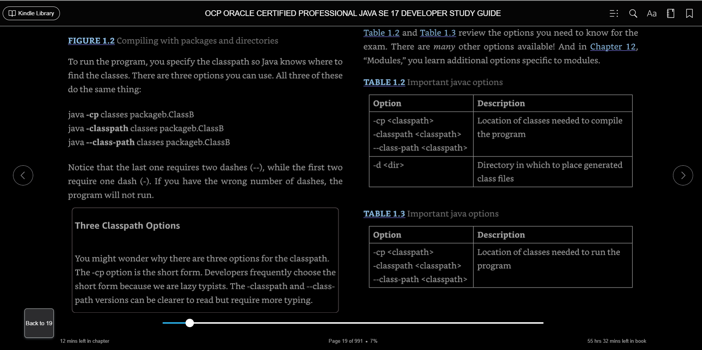

"# Java17SinPackages" 
-------------------------
Certificacion java 17
-----------------------

importante certificacion java

Enfocarse en lo importante que estan preguntando

Asumir que ciertas porciones de codigo ya se encuentran
	imports
	get y set

Importante : una variable marcada con final, no se puede reasignar

	oddities:rarezas

Rarezas: Pueden permitir obtener altos resultados en mi examen.
		 Tener cuidado y en lo posible contestar bien.
		 
	preguntas con extra informacion
		Ejemplo: XmlParseExeption. Si conoces o no XMl, pero la preguntando
		trata acerca de exepciones.
	Preguntas con preguntas embedidas
		Contestar bien dos subpreguntas antes de contestar
		la pregunta principal.
		Son respuestas no relacionadas, muchas veces.
	Preguntas con Apis no familiares
	Preguntas realizadas con conceptos errados.
		Por ejemplo, que una interfaz herede de una clase, 
		O que utilice la palabra reservada struct, es posible
		que aparezca en un examen.	
	Preguntas que realmente estan fueras de contexto.
		Debes hacer tu mejor esfuerzo por contestarlas.
	
---------

Para quien es este libro,
	Para quienes deseen aprobar los examenes. Es entendible
	y de claras explicaciones.

---------

Organizacion del Libro.
	
	Son 15 capitulos y uno va construyendo el siguiente:
	Tambien algunos capitulos cumplen mutipoes objetivos, para
	recordar los anteriores.

----------

Capitulos del libro (15)
	*$$
     
    *Cap 1
		Construcciones basicas
		Bloques, tipos de datos.
	* Cap 2
		Operadores
	* Cap 3
		Haciendo desiciones
	* Cap 4
		Api principales
	* Cap 5
		Metodos, construcciones basicas
		Como diseñar y escribir metodos
	* Cap 6
		Diseño de clases
	* Cap 7
		Dentro o detras de las clases
		(interfaces, enums, sealed clases, records, nested clases)
	* Cap 8
		Lambdas e interfaces funcionales
	* Cap 9
		Collectiones y genericos
	* Cap 10
		Streams pipelines y Optional Class.
		Lea el capito mas de una vez si quiere tener 
		los conocimientos.
	* Cap 11
		Exepciones y localizacion
	* Cap 12
		Modulos y compilacion de modulos
	* Cap 13
		concurrencia y administracion segura de hilos
	* Cap 14
		IO administracion de archivos.		
	* Cap 15
		Simple. JDBC
		
-------------------------------------
	Contestar los examenes al final de capitulo.
		Si mi porcentaje de correctas es mejor al 80%, volver
		a revisar los topicos. Comparar con apendix

-------------------------------------
	El ultimo objetivo del libro es hacerme
		un programador de calidad, 
		por supuesto tambien aprobar mi examen.
		
-------------------------------------

	Culquier duda o consulta, este sitio es utilicegit remote add origin https://github.com/Altobert/java-preparation-17-11.git
	coderanch.com

-----------

	Antes de tomar el examen, recordad entrar a www.selikoff.net/ocp17
		Lo anterior por si existen actualizaciones.
		
-----------
	
	www.wiley.com/go/Sybextestprep

-----------

	Como estudiar, 
		Construir un plan de estudios ajustado a mis horarios.
		Misntras mas consistente seas en tu estudio, 
		estaras mejor perpadado para dar el examen.
		Aunque sea un poquito a la hora de almuerzo, pero 
		todos los dias.

-----------
	Preguntarse por que lo estoy comprendiendo mal
	Estudiar esas areas aun mas. 
	
-----------
	Si UD puede determinar que el codigo compila, 
	y que linea puede estar causando que no compile, 
	responder la pregunta se puede transformar en facil.

	Si todas las respuestas a las preguntas son valores
	impresos, y no es una opcion compilar, entonces esa pregunta 
	es un regalo. Entonces que cada linea compila y UD. puede 
	utilizar la informacion de la pregunta para contestar.
-----------
	En muchos casos UD. tendra que ir eliminando respuestas
	aun leyendo la pregunta.SI esto ocurre, considere un regalo y
	no compile, si no que responda con la respuesta 
	que quedo.
	
	---
	Ir marcando las mas dificiles para responderlas despues.
	
	---

capitulo 1:
construyendo bloques:
Los objetivos OCP del examen cubiertos en este capitulo
* manejo de fechas, tiempo, texto y valores booleanos (true o false)
	** Uso de primitivos y clases envolventes incluyendo la APi Math
           uso de parentesis, promocion de tipos y casting para evaluar
	   aritmeticos y valores booleanos.
* comprender el contexto de las variable, usar variables locales tipo inferencia,
  aplicar encapsulacion y hacer objetos inmutables. 

Partiremos del comienzo solo para asegurarnos que tendras toda la temrinologia.
Como se dice, debemos caminar antes de correr, entonces deberemos saber lo basico de java
para escribir programas mas complejos.

EL examen espera que tu entiendas las reglas detras de los principios (nombre ara crear variables 3dMap or this)

enviroment:
	javac : compilador, transforma un .java en .class entendible para la maquina
	java  : interprete que ejecuta el .class
	jar   : empaqueta los archivos necesarios juntos (.class)
	javadoc: generador de documentos.

java basico
 Clase: un bloque basico de contruccion en java
 Como se usa una clase? mediante los objetos.
 Otros tipos de estructuras son los records, enum e interfaces.

 Que es un objeto?
  Es una instancia de una clase en tiempo de ejecucion. 
  Esta instancia utiliza memoria.

*Todos los diferentes objetos de las clases representan
 el estado en que se encuentra un programa.*

Que es una referencia? Es una variable que apunta un objeto.
Ejemplo: Animal animal = new Animal();

Que hace una clase?
  tiene metodos y variables que son los miembros de la clase.
  y los metodos modifican el estado de un objet
  una variable mantiene el estado de un programa, siempre y cuando
   sea importante el cambio.

Existen otros bloques de construccion como lo son los records, enum e interfaces.
Las clases son para crear objetos y en un sistema eso hace que funcione todo.
una referencia es una variable que apunta a un objeto.

metodos = comunmende llamados funciones
campos = variables, 
Todos ellos en conjunto forman parte de los miembros de una clase.

***Elementos primaros de una clase.

Las variables mantienen el estado de un programa y los metodos operan sobre
esos estados. Si esl cambio es importante la variable almacena ese cambio. Todo esto se encuentra
en una clase.
Lo anterior es todo lo que hace una clase.

Elementos primaros de una clase.***

Una palabra con especial sentido en Java es llamada Keyboard. A traves del libro
se paracaran en resaltado estos pedazos de codigo con el fin de llamar la atencion.

Un metodo publico es una funcion que puede ser llamada desde cualquier clasa
La palabra clave void significa que el metodo no tienen ningun retorno, y al usar el metodo, solicita que su información sea reemplazado. Esa informacion se llama parametro.

El siguiente metodo: public void setName(String newName) "esto es la firma de un método" tiene el nombre
setName y espera que su parametro sea reemplazado por nueva información.

comentarios simples dobles y los de documentacion, son materia sabida.

***Clases y Archivos Fuentes.***
Todo se encuentra en una clase pero tambien existen clases embedidas, o clases dento de clases. Clases de alto nivel, una clases embebida, tambien es una 
clase de alto nivel.

Una clase no requiere que teng la la palabra clave public. Se puede definir una clase "class Animal{}" y esta no tiene la palabra publica. Pero si cuenta con una clase embebida, una clase del archivo debe ser publica y tiene que tener el nombre del archivo.

1: public class Animal { 
2:    private String name;
3: 
} 
4: class Animal2 {}

Observacion: pero la clase Animal2  no compilara en el archivo llamado
Animal.java

Writing a main() Method (escribiendo un main method)
 Entry point o punto de entrada hacia el programa.
 Por que es el punto de inicio que la JVM busca para comenzar el inicio de cualquier
 programa.

EL metodo main permite que la JVM llame a nuestro codigo

Reglas que sebe tener un archivo java
	Cada archivo debe contener solamente una public class.
	el nombre del archivo debe coincidir con el nombre de la clase Publica.
	SI la clase java es entry point, entonces debe tener un valido metodo main,
	es decir la firma (signature) debe ser valida.

	String[] args
	String options[]
	String... friends

 analisis del main:
	***public (es un modificador de acceso)***: puede ser llamado de cualquier lugar

	***static*** es un metodo que pertenece a la clase y que s epuede llamar sin crear un objeto de la clase. Ejemplo Zoo.main().
	SI el main no tiene la firama correcta, la jvm no podra interpetar la clase,
	lanzando un error al correrla.

	***void*** representa el tipo de retorno vacio. Un metodo que no retorna nada, 
	devuelve el control a quien lo ha llamado. 
	Es buena practica utilizar un metodo void para cambiar el estado de los objetos.
	El metodo main cambia el estado del programa desde el inicio hasta que finaliza

	La lista de parametros del main es un array de java.lang.String objects. Existe una forama valida 
	String[] args
	String options[]
	String... friends
	el compilador acepta cualquiera de estas formas.

	***Opcional modificador permitido en un metodo main***

	//con o sin final es valido el main
	public final static void main(final String[] args) {}

	args: es u nombre comunmente usado en un main, ya que es 
	leido este arreglo de strin gpor la JVM al momento de ejecutar un programa en java

	array: es una lista de tamanio ajustado con argumentos del mismo tipo.

	varargs:lista variable de argumentos.

	------

	Para revisar, laJDK tiene un compilador, Java corre sobre
	una JVM y ambas corren en cualquier maquina con java bastante que solo la maquina y el SO ellos saben lo que 
	se ha compilado en ellos.

	Understanding Package Declarations and Imports
	Entendiendo la declaracion de paquetes e imports.

	Java viene con un monton de clases construidas,
	y se necesitan manejar como una cabina con archivos.
	Yo pongo todas mis archivos en carpetas y java los
	pone en packages. Existe una agrupoacion de clases.

	Necesitamos decir a Java donde buscarm es por eso la organizaicon de paquetes (packages).

	**Cuando declaras una clase y no importas el packete**
	Ocurre un error que el tipo no es reconocido y puedo ver
	que he omitido la sentencia import.

	java comienza a contar desde el 0 al 9 y tn total tenemos
	10 alternativas.

	Packages***
	Clases java son agrupados en packetes y la sentencia
	import le dice al compilador en cual packete ir a buscar 
	una clase.
	Esto es lo mismo al enviar un correo con una direccion.
	si le decimos al cartero, 123 Main Street, Apartment 9.
	java solo va a buscar el 9, que es el nombre de la clase.
	Los packetes tambien tienen una forma jerarquica, desde lo mas grande a lo especifico.
	For example, com.wiley.java.my.name - dice que el codigo
	se encuentra asociado a la empresa wiley.com.
	No se sorprenda si en el examen ve packetes con la siguiente forma a.b.c, el examen lo intentara confundir.

	Tambien podra observar, en los packetes, comodines (*)

	Import
	Que paquete sirve para importar AtomicInteger, como seria su nomenclatura? java.util.concurrent.atomic package.?
	import java.util.*;
	import java.util.concurrent.*;
	import java.util.concurrent.atomic.*(este);

	POr que? por que los packetes hijos no son soportados en los dos primeros.
	**Cuidado que el packete lang se importa de forma automatica, no es necesacion declarar la importacion.Estariamos redundando.

	Para que el archivo compile, que import son necesarios de declarar?
	public class InputImports {    public void read(Files files) {       Paths.get("name");    } }

	Respuesta
	import java.nio.file.*; Esta opcion considera ambas clases Path y Files
	
	//Realizar los import de forma independiente.
	import java.nio.file.Files; 
	import java.nio.file.Paths; 

	Now let's consider some imports that don't work. 
	import java.nio.*;            // NO GOOD - a wildcard only matches     // class names, not "file.Files"
	import java.nio.*.*;          // NO GOOD - you can only have one wildcard                               // and it must be at the end
	import java.nio.file.Paths.*; // NO GOOD - you cannot import methods                               // only class names

    Conflicto de nombres:
    Tiene relacion con que puede existir el mismo nombre de clase, pero utiizarlos en distintos packages. Si en un programa ocurre lo anterior
    se debe diferencias por packetes,  por ejemplo la clase Date: Que import utilizamos aca.
    public class Conflicts {    Date date;    // some more code }

    Respuesta: java.util.*; or import java.util.Date;

    Que ocurre cuando necesito todas las clases de SQL y ademas la clase Date de java.util?
    import java.util.Date; import java.sql.*;

    import java.util.Date; 
    import java.sql.Date;
    Java is smart enough to detect that this code is no good.

    public class Conflicts {        
        java.util.Date date;
        java.sql.Date sqlDate;
    }

    *********creando packetes***********
    Todo lo que se ha escrito por el momento es en el "default package"
    rodo este codigo es para tirarlo a la basura. Procupre poner nombre a sus 
    packetes. 
    Se crearon packetes en window o linux o mac lo anterior con el fin de paracitar la creacion 
    de clases dentro de packetes.

    Este comando compila y los .class los guarda en otro directorio, llamado classes.
    Lo anterior se hace pasandole el comando -d a javac. Es case sensitive, por lo que no reconocera el parametro D
    javac -d classes packagea/*.java packageb/*.java packagec/*.java

    Para ejecutar el programa se realiza de la siguiente forma :
    java -cp classes packageb.ClassB
	java -classpath classes packageb.ClassB 
	java --class-path classes packageb.ClassB

Si UD utiliza un numero distinto de dashes, el programa no se ejecutara.

Los desarrolladores realizan lo anterior, con un guion por que son flojos :)

*****Compiling with JAR Files  (A Java archive (JAR) file is like a ZIP file of mainly Java class files.)

java -cp ".;C:\temp\someOtherLocation;c:\temp\myJar.jar" myPackage.MyClass

Comandos para crear Jar

ubicacion
C:\Users\alberto.sanmartin\java-17-practica-certificacion\JavaSinPackage\directoryWithJars

comando: 
java -cp ".;C:\Users\alberto.sanmartin\java-17-practica-certificacion\JavaSinPackage\directoryWithJars;C:\Users\alberto.sanmartin\java-17-practica-certificacion\JavaSinPackage\temp\myJar.jar" packageb.ClassB

comando:
java -cp "C:\Users\alberto.sanmartin\java-17-practica-certificacion\JavaSinPackage\directoryWithJars\*" packageb.ClassB

*** Creacion de objetos **
Nuestros programas no seran capaces de hacer nada si no tenemos la habilidad de crear objetos..
 Recordar que on objeto es una instancia de una clase en tiempo de ejecucion.
{
	En las siguientes secciones veremos 
	Construcctores, 
	Atributos de objeto,
	Inicializadores de instancia 
	Orden en el cual los valores son inicializados.
}

Un objeto luce de esta forma:
	Park p = new Park();
	p = almacena la referencia al objeto.
	new Park() = Es la parte que crea el objeto.

	Constructores:
	Un constructor hace match con el nombre de la clase y no retornan un tipo. No puede tener un return.
	EL construcctor inicializa atributos.

	Muchas clase no tienen construcctores, pero por defecto el compilador crea un constructor por defecto
	que no hace nada.

	

	

	
	

	

	
	

