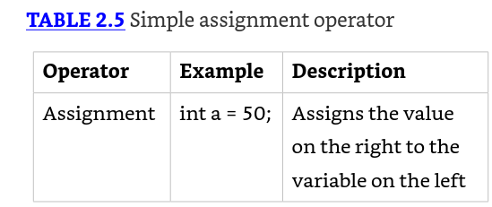
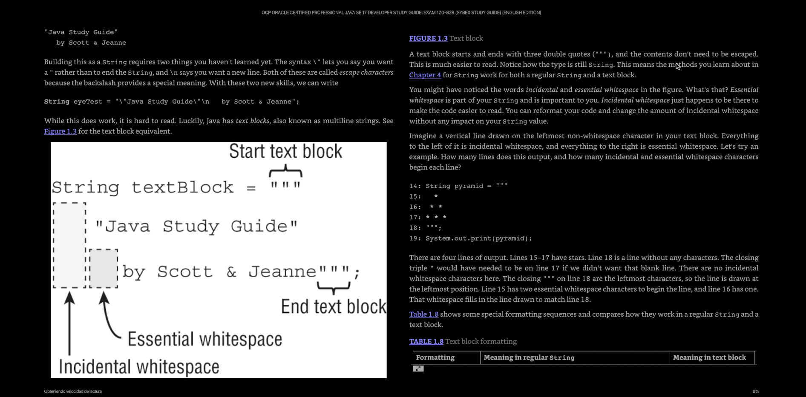
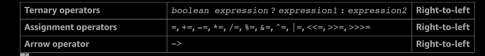
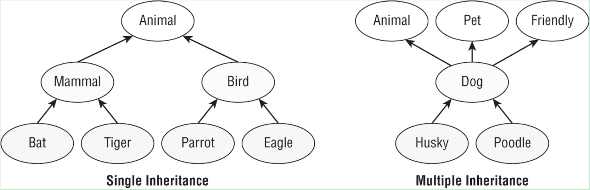

"# Java17SinPackages

## Certificacion Java 17

## Importante: Certificación Java

Enfocarse en lo importante que están preguntando

Asumir que ciertas porciones de codigo ya se encuentran
	imports
	get y set

Importante : una variable marcada con final, no se puede reasignar

	oddities:rarezas

Rarezas: Pueden permitir obtener altos resultados en mi examen.
		 Tener cuidado y en lo posible contestar bien.

	preguntas con extra informacion
		Ejemplo: XmlParseExeption. Si conoces o no XMl, pero la preguntando
		trata acerca de exepciones.
	Preguntas con preguntas embedidas
		Contestar bien dos subpreguntas antes de contestar
		la pregunta principal.
		Son respuestas no relacionadas, muchas veces.
	Preguntas con Apis no familiares
	Preguntas realizadas con conceptos errados.
		Por ejemplo, que una interfaz herede de una clase,
		O que utilice la palabra reservada struct, es posible
		que aparezca en un examen.
	Preguntas que realmente estan fueras de contexto.
		Debes hacer tu mejor esfuerzo por contestarlas.

## Para quien es este libro

Para quienes deseen aprobar los examenes. Es entendible
	y de claras explicaciones.

## Organización del Libro

Son 15 capitulos y uno va construyendo el siguiente:
	Tambien algunos capitulos cumplen mutipoes objetivos, para
	recordar los anteriores.

## Capítulos del libro (15)

### Cap 1
		Construcciones basicas
		Bloques, tipos de datos.
* Cap 2
	- Operadores
* Cap 3
	- Haciendo desiciones
* Cap 4
	- Api principales
* Cap 5
	- Metodos, construcciones basicas
	- Como diseñar y escribir metodos
* Cap 6
	- Diseño de clases
* Cap 7
	- Dentro o detras de las clases
	- (interfaces, enums, sealed clases, records, nested clases)
* Cap 8
	- Lambdas e interfaces funcionales
* Cap 9
	- Collectiones y genericos
* Cap 10
	- Streams pipelines y Optional Class.
	- Lea el capito mas de una vez si quiere tener los conocimientos.
* Cap 11
	- Exepciones y localizacion
* Cap 12
	- Modulos y compilacion de modulos
* Cap 13
	- Concurrencia y administracion segura de hilos
* Cap 14
	- IO administracion de archivos.
* Cap 15
	- Simple. JDBC

## Recomendaciones para el examen

### Contestar los examenes al final de capitulo

Si mi porcentaje de correctas es mejor al 80%, volver
a revisar los topicos. Comparar con apendix

### El ultimo objetivo del libro

Hacerme un programador de calidad,
por supuesto tambien aprobar mi examen.

### Culquier duda o consulta, este sitio es utilicegit remote add origin https://github.com/Altobert/java-preparation-17-11.git
	coderanch.com

### Antes de tomar el examen

Recordar entrar a www.selikoff.net/ocp17
Lo anterior por si existen actualizaciones.

---

www.wiley.com/go/Sybextestprep

---

### Como estudiar
		Construir un plan de estudios ajustado a mis horarios.
		Misntras mas consistente seas en tu estudio,
		estaras mejor perpadado para dar el examen.
		Aunque sea un poquito a la hora de almuerzo, pero
		todos los dias.

-----------
	Preguntarse por que lo estoy comprendiendo mal
	Estudiar esas areas aun mas.

-----------
	Si UD puede determinar que el codigo compila,
	y que linea puede estar causando que no compile,
	responder la pregunta se puede transformar en facil.

	Si todas las respuestas a las preguntas son valores
	impresos, y no es una opcion compilar, entonces esa pregunta
	es un regalo. Entonces que cada linea compila y UD. puede
	utilizar la informacion de la pregunta para contestar.
-----------
	En muchos casos UD. tendra que ir eliminando respuestas
	aun leyendo la pregunta.SI esto ocurre, considere un regalo y
	no compile, si no que responda con la respuesta
	que quedo.

	---
	Ir marcando las mas dificiles para responderlas despues.

	---

## Capitulo 1: Construyendo bloques

### Los objetivos OCP del examen cubiertos en este capitulo

* Manejo de fechas, tiempo, texto y valores booleanos (true o false)
	- Uso de primitivos y clases envolventes incluyendo la API Math
	- Uso de parentesis, promocion de tipos y casting para evaluar aritmeticos y valores booleanos.
* Comprender el contexto de las variables, usar variables locales tipo inferencia, aplicar encapsulacion y hacer objetos inmutables.

Partiremos del comienzo solo para asegurarnos que tendras toda la temrinologia.
Como se dice, debemos caminar antes de correr, entonces deberemos saber lo basico de java
para escribir programas mas complejos.

EL examen espera que tu entiendas las reglas detras de los principios (nombre ara crear variables 3dMap or this)

enviroment:
	javac : compilador, transforma un .java en .class entendible para la maquina
	java  : interprete que ejecuta el .class
	jar   : empaqueta los archivos necesarios juntos (.class)
	javadoc: generador de documentos.

java basico
 Clase: un bloque basico de contruccion en java
 Como se usa una clase? mediante los objetos.
 Otros tipos de estructuras son los records, enum e interfaces.

 Que es un objeto?
  Es una instancia de una clase en tiempo de ejecucion.
  Esta instancia utiliza memoria.

*Todos los diferentes objetos de las clases representan
 el estado en que se encuentra un programa.*

Que es una referencia? Es una variable que apunta un objeto.
Ejemplo: Animal animal = new Animal();

Que hace una clase?
  tiene metodos y variables que son los miembros de la clase.
  y los metodos modifican el estado de un objet
  una variable mantiene el estado de un programa, siempre y cuando
   sea importante el cambio.

Existen otros bloques de construccion como lo son los records, enum e interfaces.
Las clases son para crear objetos y en un sistema eso hace que funcione todo.
una referencia es una variable que apunta a un objeto.

metodos = comunmende llamados funciones
campos = variables,
Todos ellos en conjunto forman parte de los miembros de una clase.


***Elementos primaros de una clase.

Las variables mantienen el estado de un programa y los metodos operan sobre
esos estados. Si esl cambio es importante la variable almacena ese cambio. Todo esto se encuentra
en una clase.
Lo anterior es todo lo que hace una clase.

Elementos primaros de una clase.***

Una palabra con especial sentido en Java es llamada Keyboard. A traves del libro
se paracaran en resaltado estos pedazos de codigo con el fin de llamar la atencion.

Un metodo publico es una funcion que puede ser llamada desde cualquier clasa
La palabra clave void significa que el metodo no tienen ningun retorno, y al usar el metodo, solicita que su información sea reemplazado. Esa informacion se llama parametro.

El siguiente metodo: public void setName(String newName) "esto es la firma de un método" tiene el nombre
setName y espera que su parametro sea reemplazado por nueva información.

comentarios simples dobles y los de documentacion, son materia sabida.

### Clases y Archivos Fuentes

Todo se encuentra en una clase pero tambien existen clases embedidas, o clases dentro de clases. Clases de alto nivel, una clases embebida, tambien es una
clase de alto nivel.

Una clase no requiere que teng la la palabra clave public. Se puede definir una clase "class Animal{}" y esta no tiene la palabra publica. Pero si cuenta con una clase embebida, una clase del archivo debe ser publica y tiene que tener el nombre del archivo.

1: public class Animal {
2:    private String name;
3:
}
4: class Animal2 {}

**Observación:** pero la clase Animal2 no compilara en el archivo llamado
Animal.java

### Escribiendo un main() Method

Entry point o punto de entrada hacia el programa.
Por que es el punto de inicio que la JVM busca para comenzar el inicio de cualquier
programa.

El metodo main permite que la JVM llame a nuestro codigo

### Reglas que debe tener un archivo java

* Cada archivo debe contener solamente una public class.
* El nombre del archivo debe coincidir con el nombre de la clase Publica.
* Si la clase java es entry point, entonces debe tener un valido metodo main, es decir la firma (signature) debe ser valida.

### Firmas válidas para el array de parámetros

```java
String[] args
String options[]
String... friends
```

### Análisis del main

**public (es un modificador de acceso)**: puede ser llamado de cualquier lugar

**static**: es un metodo que pertenece a la clase y que se puede llamar sin crear un objeto de la clase. Ejemplo Zoo.main().
Si el main no tiene la firma correcta, la JVM no podra interpretar la clase,
lanzando un error al correrla.

**void**: representa el tipo de retorno vacio. Un metodo que no retorna nada,
devuelve el control a quien lo ha llamado.
Es buena practica utilizar un metodo void para cambiar el estado de los objetos.
El metodo main cambia el estado del programa desde el inicio hasta que finaliza

	La lista de parametros del main es un array de java.lang.String objects. Existe una forama valida
	String[] args
	String options[]
	String... friends
	el compilador acepta cualquiera de estas formas.

	***Opcional modificador permitido en un metodo main***

	//con o sin final es valido el main
	public final static void main(final String[] args) {}

	args: es u nombre comunmente usado en un main, ya que es
	leido este arreglo de strin gpor la JVM al momento de ejecutar un programa en java

	array: es una lista de tamanio ajustado con argumentos del mismo tipo.

	varargs:lista variable de argumentos.

---

Para revisar, la JDK tiene un compilador, Java corre sobre
una JVM y ambas corren en cualquier maquina con java bastante que solo la maquina y el SO ellos saben lo que
se ha compilado en ellos.

### Understanding Package Declarations and Imports

**Entendiendo la declaracion de paquetes e imports.**

Java viene con un monton de clases construidas,
y se necesitan manejar como una cabina con archivos.
Yo pongo todas mis archivos en carpetas y java los
pone en packages. Existe una agrupacion de clases.

Necesitamos decir a Java donde buscar, es por eso la organizacion de paquetes (packages).

**Cuando declaras una clase y no importas el package**

Ocurre un error que el tipo no es reconocido y puedo ver
que he omitido la sentencia import.

Java comienza a contar desde el 0 al 9 y en total tenemos
10 alternativas.

### Packages

Clases java son agrupadas en packages y la sentencia
import le dice al compilador en cual package ir a buscar
una clase.
Esto es lo mismo al enviar un correo con una direccion.
	si le decimos al cartero, 123 Main Street, Apartment 9.
	java solo va a buscar el 9, que es el nombre de la clase.
	Los packetes tambien tienen una forma jerarquica, desde lo mas grande a lo especifico.
	For example, com.wiley.java.my.name - dice que el codigo
	se encuentra asociado a la empresa wiley.com.
	No se sorprenda si en el examen ve packetes con la siguiente forma a.b.c, el examen lo intentara confundir.

	Tambien podra observar, en los packetes, comodines (*)

	Import
	Que paquete sirve para importar AtomicInteger, como seria su nomenclatura? java.util.concurrent.atomic package.?
	import java.util.*;
	import java.util.concurrent.*;
	import java.util.concurrent.atomic.*(este);

	POr que? por que los packetes hijos no son soportados en los dos primeros.
	**Cuidado que el packete lang se importa de forma automatica, no es necesacion declarar la importacion.Estariamos redundando.

	Para que el archivo compile, que import son necesarios de declarar?
	public class InputImports {    public void read(Files files) {       Paths.get("name");    } }

	Respuesta
	import java.nio.file.*; Esta opcion considera ambas clases Path y Files

	//Realizar los import de forma independiente.
	import java.nio.file.Files;
	import java.nio.file.Paths;

	Now let's consider some imports that don't work.
	import java.nio.*;            // NO GOOD - a wildcard only matches     // class names, not "file.Files"
	import java.nio.*.*;          // NO GOOD - you can only have one wildcard                               // and it must be at the end
	import java.nio.file.Paths.*; // NO GOOD - you cannot import methods                               // only class names


    Conflicto de nombres:
    Tiene relacion con que puede existir el mismo nombre de clase, pero utiizarlos en distintos packages. Si en un programa ocurre lo anterior
    se debe diferencias por packetes,  por ejemplo la clase Date: Que import utilizamos aca.
    public class Conflicts {    Date date;    // some more code }

    Respuesta: java.util.*; or import java.util.Date;

    Que ocurre cuando necesito todas las clases de SQL y ademas la clase Date de java.util?
    import java.util.Date; import java.sql.*;


    import java.util.Date;
    import java.sql.Date;
    Java is smart enough to detect that this code is no good.

    public class Conflicts {       
        java.util.Date date;
        java.sql.Date sqlDate;
    }

    *********creando packetes***********
    Todo lo que se ha escrito por el momento es en el "default package"
    rodo este codigo es para tirarlo a la basura. Procupre poner nombre a sus
    packetes.
    Se crearon packetes en window o linux o mac lo anterior con el fin de paracitar la creacion
    de clases dentro de packetes.

    Este comando compila y los .class los guarda en otro directorio, llamado classes.
    Lo anterior se hace pasandole el comando -d a javac. Es case sensitive, por lo que no reconocera el parametro D
    javac -d classes packagea/*.java packageb/*.java packagec/*.java

    Para ejecutar el programa se realiza de la siguiente forma :
    	java -cp classes packageb.ClassB
	java -classpath classes packageb.ClassB
	java --class-path classes packageb.ClassB

Si UD utiliza un numero distinto de dashes, el programa no se ejecutara.

Los desarrolladores realizan lo anterior, con un guion por que son flojos :)



*****Compiling with JAR Files  (A Java archive (JAR) file is like a ZIP file of mainly Java class files.)

java -cp ".;C:\temp\someOtherLocation;c:\temp\myJar.jar" myPackage.MyClass

Comandos para crear Jar

ubicacion
C:\Users\alberto.sanmartin\java-17-practica-certificacion\JavaSinPackage\directoryWithJars

comando:
java -cp ".;C:\Users\alberto.sanmartin\java-17-practica-certificacion\JavaSinPackage\directoryWithJars;C:\Users\alberto.sanmartin\java-17-practica-certificacion\JavaSinPackage\temp\myJar.jar" packageb.ClassB

comando:
java -cp "C:\Users\alberto.sanmartin\java-17-practica-certificacion\JavaSinPackage\directoryWithJars\*" packageb.ClassB

### Creación de objetos

Nuestros programas no seran capaces de hacer nada si no tenemos la habilidad de crear objetos.
Recordar que un objeto es una instancia de una clase en tiempo de ejecucion.

En las siguientes secciones veremos:
* Constructores
* Atributos de objeto
* Inicializadores de instancia
* Orden en el cual los valores son inicializados

### Un objeto luce de esta forma:

```java
Park p = new Park();
```

* `p` = almacena la referencia al objeto.
* `new Park()` = Es la parte que crea el objeto.

### Constructores

* Match con el nombre de la clase
* No retornan un tipo. No puede tener un return.
* El constructor inicializa atributos.

	Muchas clase no tienen construcctores, pero por defecto el compilador crea un constructor por defecto,
	que no hace nada.

	Ojo con los metodos que tienen nombre y comienzan con letra capital, pero
cuentan con retorno, esos no son un constructor, es posible que compile
pero no se podra llamar con un new.

La principal funcion de uns constructor es inicializar variables. Tambien
se pueden inicializar variables cuando son declaradas.
public class Chicken {   
	int numEggs = 12;  // initialize on line
	String name;   
	public Chicken() {
		name="Duke";
	}
}

### Reading and Writing Member Fields

Es posible leer y escribir en variables de instancia de
forma directa de parte del "caller". Es decir desde quien lo llama.
Quien es el caller en el ejemplo, es el metodo main, que puede estar
en la misma clase u en otra.
Para proteger los atributos se aprendera de la encapsulación en el cap5
y no setear de forma negativa los atributos de instancia.

### Executing Instance Initializer Blocks

(Ejecutando bloques de inicializacion)

	{} braces que inicializan y cierran un metodo
	Dentro se escribe el codigo del metodo.
	Estos se ejecutan cuando es llamado el metodo.
	Otras veces, los brazos, aparecen fuera de los metodos.
	Estos son los inicializadores de instancia.
	En el capitulo 6 aprenderemos de los inicializadores statics

Cuantos inicializadores instancia se ven en el codigo?
Son cuatro pares de brazos.
public class Bird {
	2:    public static void main(String[] args) {
			 // se ejecuta cuando se llama al metodo main
	3:       { System.out.println("Feathers"); }
	4:    }
	//solo este es un incializador de instancia
	{ System.out.println("Snowy"); }
}

SI no hay el mismo numero de pares de brazos, el codigo no compilara.
Esto es el "problema de balanceo de parenthesis" y se pregunta en las entrevistas

Los inicializadores de instancia no existen dentro de un metodo, estan fuera, al nivel de la clase.

### Orden de inicializacion de brazos

Cuando se encuentran los inicializadores en multiples lugares, se debe tener en
cuenta el orden de iniciailzacion.

Algunas consideraciones:
* Atributos e inicializadores bloques, se ejecuta en el orden que se encuentran en el archivo.
* El constructor se ejecuta despues que todos los atributos e inicializadores de bloques se hayan ejecutado.

	no se puede utililzar un atributo antes antes de ser definida.
	{ System.out.println(name); }  // DOES NOT COMPILE
	private String name = "Fluffy";

	******
	Let's look at what's happening here. We start with the main() method because that's where Java starts execution. On line 9, we call the constructor of Chick. Java creates a new object. First it initializes name to "Fluffy" on line 2. Next it executes the println() statement in the instance initializer on line 3. Once all the fields and instance initializers have run, Java returns to the constructor. Line 5 changes the value of name to "Tiny", and line 6 prints another statement. At this point, the constructor is done, and then the execution goes back to the println() statement on line 10. Order matters for the fields and blocks of code. You can't refer to a variable before it has been defined:
	******

### Referencias

Un tipo de dato primitivo se mantiene en memoria, con su valor.
Una referencia, no mantiene el valor del objeto al cual refieren. En vez de eso,
una referencia apunta a un objeto para almacenar la direccion de memoria,
donde el objeto es ubicado. El concepto referencia es un puntero.
A diferencia de otros lenguajes, java no permite que aprendas que memoria fisica
estas direccionando.
Tu solamente puedes usar la referencia para referir al objeto.

```java
String greeting; // esta es una referencia apunta a un objeto String.
```

El valor es asignado a la referencia de una o dos formas:
* Una referencia puede ser asignada a otro objeto del tipo compatible
* Una referencia puede ser asignada a un nuevo objeto usando el keyword
		new.

		En el siguiente ejemplo se asigna el nuevo objeto a la referencia
		greeting = new String("How are You");

		La referencia greeting apunta a un nuevo objeto String "How are you"
	El objeto String no tiene un nombre y solo puede ser accesado por la
	via de su correspondiente referencia.

	Distinguiendo entre referencias y tipos primitivos.
	 Existen unas pocas importantes diferencias entre primitivas y referencias.
	 Los tipos primitivos tienen minusculas en sus nombres. Las clases Java
	 comienzan todas con la primera letra Mayusculas. Uno debe seguir esta
	 convencion.

	 Segundo, las referencias son usadas para llamar metodos, asumiendo que la
	 referencia no es null. Los primitivas no tienen metodos declarados. Ejemplo
	 de la referencia que llama aun metodo

	 String reference = "hello"
	 int len = reference.length();
	 int bad = len.length(); // esto no compila

	 Un primitivo no tiene referencias, por lo cual no pueden llamar metodos.
	 Recuerde que un String no es un primitivo, entonces puedes llamar metodos,
	 como length(); que pretenece a la referencia String.


	 Linea 6 es "algo que no tiene explicacion" len no tiene metodos por que len
	 es un primitivo, los primitivos no tienen metodos, recuerde, String no es un
	 primitivo, entonces UD. puede llamar al metodo len, para la referencia
	 de String.

	 Finalmente las referencias se les puede asignar null, que significa que
	 no apunta o hace referencia aun objeto.

	 Los primitivos dan error de compilacion si se les asigna un null.
	 Ejemplo:
	 int value = null// no compila
	 String name = null;

	 Pero si no sabes el valor valor de un int y quieres asignarle un null?,
	 para ese caso deberias usar una clase wrapper, como Integer en vez de int.

	 Clases wrapper
	 Cada tipo de dato primitivo tiene su clase envoltorio, el cual es un tipo de objeto
	 que le corresponde a su primitivo.

	 int primitive = Integer.parseInt("123");
	 Integer wrapper = Integer.valueOf("123");

	 30-06-2025
	 Cuando no sepas como partir, parte como sea, con la idea que sea! CSMC
	 30-06-2025

	 algunas clasese wrapper contienen metodos helper para trabajar con numeros. No los debes memorizar

	 **definiendo bloques de texto**
	 Vimos al comienzo una definicion simple de string, pero que pasa si necesitamos algo mas complicado?
	 Imaginemos que tenemos que crear un string con la siguiente forma:

	 (identacion incluida) 
	 "Java Study Guide"    
	 	by Scott & Jeanne

	Para construir el string anterior, requiere dos cosas que no hemos aprendido aun.
	sintaxis \"podemos poner lo que queramos"
			 \n para una nueva linea
	
	lo anterior es llamado caracteres de escape. El backslash provee un especial sentido.
	
	void sandFence() {    
		String s1, s2;    // variables solamente declaradas
		String s3 = "yes", s4 = "no"; // variables declaradas e inicializadas.
	}
	
	// declarado y ambos inicializados en cero.
	void paintFence() {    
		int i1, i2, i3 = 0; 
	}

	***04/07 - 
	Inicializacion de variables, 
	Antes que UD pueda usar una variable, necesita un valor. Algunos tipos de variable 
	traen un valor por defecto, se forma automatica y otras requiere que el programador las especifique. 
Veremos las diferencias entre:
* Default para local: (dentro de un metodo)
* Instancia (atributos de un objeto)
* Variables de clase: (static)

**Variables locales:** son creadas dentro de un constructor, metodo o bloque de inicializacion.

### Variables locales final

final es una palabra clave aplicada a una constante en otros lenguajes.

Ejemplo:

```java
final int y = 10;
int x = 20;
y = x + 10; //no compila. // y no puede ser modificado por ser final // constante.
```

La palabra clave final tambien puede ser aplicada a variables locales de referencia.

```java
final int [] favoriteNumbers = new int[10];
favoriteNumbers[0] = 10;
favoriteNumbers[2] = 20;
favoriteNumbers = null; // no compila.
```

El error ocurre cuando trato de "CAMBIAR" el valor de la referencia favoriteNumbers

### Variables locales no inicializadas

Las variables locales no tienen un valor por defecto y deben ser inicializadas antes
de ser usadas. El compilador reportara un error si tu intentas leer una variable sin inicializar.

```java
public int notValid(){
	int y = 10;
	int x; // no ha sido inicializado
	int reply = x+y; // no compila.
	return reply;
}
```

Y fue inicializado en 10 pero x por contraste no lo ha sido.

El COMPILADOR es lo suficientemente listo como para reconocer variables que han sido inicializadas
despues de su declaracion pero antes son usadas.

```java
public int valid(){
	int y = 10;
	int x;// x es declarado aqui
	x = 3;
	int z;//declarada la z pero no inicializada.
	int reply = x+y;
	return reply;
}
```

Al compilador java le interesa lo que yo uso sin ser inicializado, es decir, solamente le concierne 
si yo intento usar no inicializadas variables locales, no le importa lo que nunca voy a usar.

```java
public void findAnswer(boolean check){
	int answer;
	int otherAnswer;
	int onlyOneBranch;
	if(check){
		onlyOneBranch = 1;
		answer=1;  // sea true, aca se inicializa antes de ser usada.
	}else{
		answer =2; // sea false aca se inicializa antes de ser usada.
	}
	System.out.println(answer); // aca se usa la variable
	System.out.println(onlyOneBranch); // error de compilacion
}
```

// El compilador es lo suficientemente inteligente para darse cuenta que onlyOneBranch
// puede ser NO inicializado al pasar a false de la rama (else).
// Sin embargo, la variable answer pase por la rama que sea, siempre se inicializara y eso 
// el compilador lo detecta.

// La variable otherAnswer, no se inicializa, pero no se usa, asi que el compilador
// continua feliz.

**IMPORTANTE:** Al compilador siempre le importa si yo intento utilizar variables no inicializadas,
no le importa las variables que no inicializo y nunca uso.

---

### Notas sobre inicialización de bloques

* El orden en que se ejecuta la ejecución y compilación.
* Inicializacion de variables locales e instancias.

> **LA certificación es aprender a reconocer y entender al compilador JAVA, de acuerdo a su versión.**

El compilador puede darse cuenta que al pasar por las ramas IF-ELSE, la variable podria no inicializarse, por lo que arrojara un 
error de compilacion.

**NOTA Importante:** En el examen de certificación tenga cuidado con cualquier variable local sea declarada pero no inicializada
en una unica linea. Esto puede resultar que la respuesta pregunta de certificacion "NO COMPILA". Asegurese de revisar y asegurarse
si la variable sea INICIALIZADA ANTES DE SER USADA.

### Pasando constructores y metodos parametros

Variables pasadas a un constructor o a un metodo se llaman "constructor parameters" o "method parameters", respectivamente.

In the previous example, check is a method parameter.

```java
public void findAnswer(boolean check) {}
```

Take a look at the following method checkAnswer() in the same class:

```java
public void checkAnswer() {
   boolean value;
   findAnswer(value);  // DOES NOT COMPILE
}
```
	public void checkAnswer() {
   		boolean value;
   		findAnswer(value);  // DOES NOT COMPILE
   	}

	En este punto ocurrira lo mismo, esto no compilara por que la variable es usada antes de ser inicializada.

	
	***Definiendo instancia y Variables de Clase***

	"Variables que no son locales entonces son variables de instancia o variables de clase."
	Una variable de instancia tambien definido campo, 
	es un valor definido dentro de una instancia especifica de un objeto. Digamos lo siguiente:
	Tenemos una clase Persona con una variable de instancia nombre, se tipo String,
	Cada instancia de esta clase, tendra su propio valor de "name"
	tal como Elyshia o Sarah. Dos instancias pueden tener el mismo valor para nombre , 
	pero cambiando el valor de uno no midificara el otro.


	******Infiriendo el "Typo" with var**************
	Tengo la opcion de usar la "keyword" var en una variable local bajo ciertas contidiones.
	En una variable local se puede escribir var en ves de una referencia o un tipo primitivo.
	
	Ejemplo:
	
	public class Zoo{
		public void whatTypeAmI(){
			var name="Hello";
			var size=7;
		}
	}

	El nombre formal de esta variable es: "variable local tipo inferencia"
	COmo lo dice su nombre, solo de puede usar en contexto de variable local.
	EL examen intentara engañarte, como por ejemplo:

	public class VarKeyboard{
		var tricky="HELLO"; // esto no compila
	}

	Esta es una variable de instancia, por lo cual esta es la trampa. La variable 
	por inferencia solo funciona en definiendo una variable local. 

	:::::::::::::::::::::Tipo inferencia de var:::::::::::::::::::::::::::

	Cual es el sentido de la variable tipo inferencia? El sentido que tiene es el como 
	suena. Cuando escribo var, le digo al compilador que determine el tipo por mi. El com
	pilador ve la declaracion e inicializacion e infiere el tipo.


	public void reassignement(){
		var number =7;
		number=4;
		number="FIVE"//DOES NOT COMPILA
	}

	No esta permitido utilizar el tipo inferencia, y luego cambiar a String como en el ejemplo anterior.

	En javascript se encuentra permitido, aun, permitir cualquier tipo en tiempo de ejecucion, pero java
	el tipo aun se define en tiempo de compilacion y no puede ser cambiando en tiempo de ejecucion o (runtime)

	El siguiente ejemplo es válido. UD podría insertar un salto de linea en la sentencia y aun es válido.

	public void breakingDeclaration(){
		var silly
		=1;
	}
	Es correcto, pero la inicializacion de silly debe ser en la misma línea o sentencia.

	:::::::::::Mas ejemplos con var::::::::::::
	public boolean doesThisCompile(boolean check){
		var question;
		question=1;
		var answer;
		if(check){
			answer = 2;
		}else{
			answer = 3;
		}
		System.out.println(answer);
	}
	// este codigo no compila por que debe estar inicializado en la misma sentencia y no en la linea siguiente.
	// el compilador no sabe que hacer por que no esta asignado el valor en la linea de la declaracion.
	EL codigo anterior no es valido desde question y answer por que no fue inicializado en la misma sentencia
	de declaracion. Ahora sabemos que la inicializacion debe formar parte de la declaracion, a hablar de var.

	puede UD imaginar por que estas dos sentencias no compilan?
	Por que 

	// otro codigo de prueba
	public void twoTypes(){
		int a, var b=5; // does not valid
		var n = null; // does not valid
	}
	no compila por que la primera linea no tiene le mismo tipo. Funcionaria si  b fuese int
	y no esta permitido a los tipo inferencia recibir valores de objetos.

	public int addition(var a , var b){ // does not valid
		return a + b;
	}
	Lo anterior no es valido por que el tipo inferencia es usado de forma local, en los metodos,
	y no en method parameters.

	Se debe tener cuidado con el tipo inferencia cuando es usado en constructores, method parameters,
	o variables de instancia. Usar variables de instancia en estos lugares es un buen intento 
	que realiza el examen para engañarme.

	package var;
	public class Var{
		public void var(){
			var var = "var";
		}
		public void Var(){
			Var var = new Var();
		}
	}
	//Crealo o no este codigo compila. No lo haga en su trabajo, pero entienda por que no funciona
	para el caso que algun examinador lance una pregunta como estas.

	var puede ser utilizado como identificador por que no es palabra reservada
	var es considerado un "reserved type name" y quiere decir que no puede ser usado para 
	definir un type, como class, interface or enum.

	var en el mundo Real:
	Se usa solo para los autores de examenes y asi engañar a los participantes. Por favor no utilice var 
	en su trabajo pero esta bien que entienda por que puede ser de ayuda en los examenes.

	A vesves puede usar var cuando las sentencias son demasiado largas.
	Ej.
	PileOfPapersToFileInFilingCabinet pileOfPapersToFile= new PileOfPapersToFileInFilingCabinet();
	var pileOfPapersToFile = new new PileOfPapersToFileInFilingCabinet();

	If you are ever unsure whether it is appropriate to use var, 
	we recommend “Local Variable Type Inference: Style Guidelines,” 
	which is available at the following location. https://openjdk.java.net/projects/amber/LVTIstyle.html

	19-01-2026
	Se puede imaginar por que estas dos sentencias no compilan?
	public void twoTypes(){
		int a, var b=3; // does not compile
		var n = null;  // does not compile
	}
	primera linea compilaria si se agrega el tipo.
	si se declara en una linea, deben compartir el mismo tipo

	pero tampoco puede ser asi:
	int a, int b; // tampoco compila.

	var n = null;
	Acá el compilador esta siendo consultado para 
	inferir el tipo null. Puede ser cualquier referencia.
	La unica opcion que puede ser es null. EL diseñador de 
	java encontro mejor no permtir var de null.
	No se puede inferir un null cuando no se sabe el tipo.

	// esto si es permitio:

	var s = "Hola"; // aquí el compilador infiere que s es String
    s = null;       // válido, porque String es un tipo de referencia

	public class VarNullExample {
    public static void main(String[] args) {
        // var x = null; // ERROR: no se puede inferir tipo

        var texto = "Copilot"; // tipo inferido: String
        texto = null;          // válido, porque String es referencia

        var numero = 10;       // tipo inferido: int
        // numero = null;      // ERROR: int no admite null
    }
}

// no se puede usar en este lugar el tipo de variable inferencia
public int adition(var a, var b){	
	return a + b;
}


	method parameters.
	public void sumar(int a, int b)
	
	parameter local
	public void sumar(){int a, int b;}

	variable de instancia
	el momento en que se ejecuta el objeto de la clase
	cada objeto tiene su variable de instancia. 

	variable de clase
	tiene el atributo static


	El tipo de variable var, (tipo inferencia)
	solo puede ser usado en variables locales.

	no se puede usar en contructores, method parameters, or
	instance variables. Usar en estos lugares es un buen engaño
	si UD. esta tomando atencion.

	... lo ultimo, var no es una palabra reservada por lo que se puede usar 
	package var;


	var puede ser utilizado como identificador de variable ya que no es palabra reservada.
	es considerado como un rerserved type name, y su sentido es que no puede ser usado 
	para definir un tipo como Class Interface o Enum.

	Importante a considerar

	Esto es importante que lo entienda:

	PileOfPapersToFileInFilingCabinet pileOfPapersToFile = new PileOfPapersToFileInFilingCabinet();
O
	var pileOfPapersToFile =  new PileOfPapersToFileInFilingCabinet();

	Si UD aun no se encuentra seguro donde utilizar o no el variable tipo de inferencia, 
	puede leeer lo siguiente:

	If you are ever unsure whether it is appropriate to use var, 
	Si Ud aun no se encuentra seguro de como usar apropiadamente 
	la variable tipo de inferencia.
	we recommend “Local Variable Type Inference: Style Guidelines,” which is available at the following location. https://openjdk.java.net/projects/amber/LVTIstyle.html

	19-01-2026

20-01-2026
	Maning variable scope	
	---------------------

	Las variables locales son declaradas dentro de un bloque de codigo. 
	cuantas variables se pueden ver?

	public void eat(int pieceOfChease){
		int bitesOfChiesse=1;
	}

	veo dos, method parameter and local variable.

	Variables locales no pueden tener un contexto mas largo que el metodo
	donde se encuentran. Tambien pueden tener un contexto mucho mas pequeño

	public void eatIdHungry(boolean humgry){ // hungry tiene todo el contexto del metodo

		if(hungry){
			int bitesOfChesse = 1;

		}// bitesOfChese se encuentra fuera de contexto desde aca

		System.out.println("bitesOfChesse"); //DOES NOT COMPILE

	}

	la variable hungry tiene todo el contexto del metodo.
	la variable bitesOfChesse se encuentran eun contexto pequeño, dentro del if.

	{} estos simbolos indican que has entrado a un nuevo bloque de codigo y tienen 
	un contexto propio y mas pequeño.

	Variables definidad en loques mas largos pueden ser dedifinos en contextos mas 
	pequeños, pero no viceversa.


	public void eatIdHungry(boolean humgry){ // hungry tiene todo el contexto del metodo

		if(hungry){

			int bitesOfChesse = 1; // esto si puede ser;
			{
				var teenyBit = true;
				System.out.println(bitesOfChesse); //Yes COMPILE
			}

		}// bitesOfChese se encuentra fuera de contexto desde aca
		System.out.println(teenyBit); //Yes COMPILE
		
	}

	Traceando el contexto
	---------------------
	Algunas veces el programa, en el examen, fallara en la compilacion
	por que se cae en el contexto. Alguna variable ha sido utilizada 
	fuera de su contexto local.
	Hagamos un ejercicio, no te asustes si no te sientes familiar, conlas sentencias 
	if o while loops.
	Imaginate cual de las 5 variables locales se encuentra una o mas fuera del contexto.

11: public void eatMore(boolean hungry, int amountOfFood) {
12:    int roomInBelly = 5;
13:    if (hungry) {
14:       var timeToEat = true;
15:       while (amountOfFood> 0) {
16:          int amountEaten = 2;
17:          roomInBelly = roomInBelly - amountEaten;
18:          amountOfFood = amountOfFood - amountEaten;
19:       }
20:    }
21:    System.out.println(amountOfFood);
22: }
// yo creo que no hay error y estan todas las variables locales en su contexto. Ninguna utilizada fuerade su contexto.
23-01-2026
Aplicando lo enseñado, se debe comenzar desde el bloque mas interno hasta el externo asi identificar los contextos.
Partir por el while, luego el if y luego el bloque del metodo.
Sabiendo lo anterior, podemos identificar el scope de cada variable.

hungry and amountOfFood : son method parameters, por lo tanto, estan disponibles para todo el metodo. Es decir, 
de la linea 11 a la 22.

variable roomInBelly, Se puede usar y está declarada dentro del metodo, y abarca hasta la linea 22.

variable timeToEat, Se puede dentro del contexto del if y del while

:: Se puede practicar esto, los brazos de los metodos para entender 
en que contexto se encuentra la variable. Todo libro tiene muchos 
ejemplos asi.

Aplicando scope a Clases:
La regla para las variables de instancia es facil y estaran viceversapor toda la vidad del objeto se 
encuentre.

## 23-01-2026

## 04-02-2026

```java
1:  public class Mouse {
2:     final static int MAX_LENGTH = 5;
3:     int length;
4:     public void grow(int inches) {
5:        if (length < MAX_LENGTH) {
6:           int newSize = length + inches;
7:           length = newSize;
8:        }
9:     }
10: }
```

En este ejemplo, se visualizó el contexto de la variable de clase MAX_LENGTH
la variable de instancia length
la method variables como inches
y la variable int newSize se puede usar solo desde la 6 a la linea 8


Revision del contexto

De que va todo esto? Revisemos las reglas del contexto.
Local variables : Dentro del contexto desde la declaracion hasta
el fin del contexto.
Method parameters : EN el contexto de duracion del metodo.
Instance variables: Dentro del contexto de la declaracion hasya que el 
objeto es eligible por el GB
Class Variables: Dentro del scope de declaracion hasta que el programa
finaliza.


Destruyendo objetos:
Hemos jugados con nuestros objetos, ahora es tiempo de ponerlos lejos
Suertudamente JVM se preocupa de todo eso por nosotros. Java proveea GC 
para que automaticamente busque los objetos que no son mas necesarios.

Recuerda, tu codigo no es el unico corriendo en mi programa java. 
El codigo java existe dentro de la JVM y la cual tiene dentro de siun monton
de procesos independientes del codifo de mi aplicacion.

Uno de los mas imposrtantes de ellos es el GC.

Todos los objetos java son almacenados en el HEAP DE LA memoria
de mi prgrama. EL HEAP tambien conocido como la memoria libre y 
representa una larga piscina o espacio de memoria en deshuso
asignada a mi aplicacion en java.

Si mi programa se mantiene instanciando objetos y dejandolos
dentro del HEAP, eventualmente correra un out of memory
y se caera. Oh no, suertudamente el GC resuelve este problema.

Entendiendo el GC

El GC se refiere a un proveso que atumaticamente libera espacio en el HEAP
eliminando objetos que dejaron de ser usados por mi programa.

Existen muchos algoritmos que usa el GC pero yo no necesito saberlos
para el examen.
EL GC determina cuando un objeto tiene pertenecer en memoria
considerando ei el objeto es usado o no en el programa.

Si un objeto es elegido por el GC, inmediatamente es colected 
liberado? Definitivamente no. Cuando el objeto es descartado, 
ya no se encuentra bajo mi control, pero para el examenes yo necesito saber 
si en cualquier momento dado, cual objeto es eligible por el GC.

ENtiendelo asi. Como enviando un paquete. Puedo tomar cualquier item 
etiquetarlo y ponerlo en la casilla de correo. Esta es la forma analoga
en que el GC hace eligible un item. CUando el cartero viene y se llevan
el paquete ya se encuentra fuera de mi control.

04-02-2026

16-02-2026

Para el examen, yo solo necesito saber que en cualquier momento dado, 
cual o cuales objetos son elegibles por el GC.

Yo puedo etiquetar mi objeto y ayudar al Gc con el siguiente metodo:
System.gc();

Al igual que una oficina postal, java me puede ignorar, y no me asegura
que me tomara en cuenta. 


:::::::Traceando la eligibilidad:::::::::
COmo sabe la JVM que un objeto es elegible por la GC?
La JVM espera y monitorea cada objeto hasta que determina que el objeto
no necesita permanecer en memoria (HEAP)
Un objeto se mantendra en el heap hasta que no sea accesible. Un objeto no permanece
accesible cuando estas dos situaciones ocurren

	El objeto no cuenta con mas referencias apuntandolo
	Todas las referencias del objeto se han ido fuera del contexto.


:::::::::::::::::OJO::::::::::::::::::

-No se confunda una referencia con el objeto al cual se refiere. Ellas son dos entidades diferentes.
La referencia es una variable que tiene un nombre y puede ser usada para acceder al contenido de 
un objeto. Una referencia puede ser asignada a otra referencia, pasada hacia un metodo o retoernada
desde un metodo. Todas las referencias tienen el mismo peso y no importa que tipo sea. 

Ub objeto se ajusta en el heap y no tiene nombre. Consecuentemente, tu no tienes una forma 
de acceder al objeto si no es atraves de su referencia. Los objetos vienen en diferentes formas y tamanios
y consumen diversos tamaños de memoria. 

Un objeto no puede ser asignado a otro objeto. Y un objeto no puede ser asignado a otro objeto, y 
un objeto no puede ser pasado hacia un metodo o devuelto desde un metodo. Es el objeto que se colecciona
desde el GC , no su referencia.

Realizando o llevando a cabo  la referenia entre el objeto que apunta
queda un largo camino de comprendiendo el garbage collector, el operador new y muchasotras 
caras del lenguaje java Mira el siguiente codigo y mira si es posible 
imaginar cuando un objeto se vuelve eligible para el garbage collector.

```java
1: public class Scope {
2:    public static void main(String[] args) {
3:       String one, two;
4:       one = new String("a");
5:       two = new String("b");
6:       one = two;
7:       String three = one;
8:       one = null;
9: }}
```

Te recomiendo que dibujes que esta pasando cuando te hagan una pregunta acerca del GC 
en el examen. Puedes comenter un error intentando mantener muchas cosas en tu cabeza.
16-02-2026

## 02-03-2026

No todas las preguntas incluiran declaracion de packages o imports.
No te preocupes acerca de paquetes extraviados o sentencias de import
a menos que te lo pregunten. Estos son los casos que tu no tienes que 
revisar los imports:

* Código que comienza con un nombre de clase.
* Código que comienza con la declaracion de un metodo.
* Código que comienza con un extracto de codigo que normalmente esta dentro de una clase o metodo.
* Código que tiene numeros de lineas que no comienzan con 1.

UD vera codigo que no tiene un metodo. Cuando esto ocurra asuma lo 
necesario, fontaneria de codigo, como un main method y definicion 
de clase fueron escritos correctamente. UD solo esta siendo consultado
que la parte del codigo que esta siendo mostrado compila cuando tu lo 
pones rodeado de un codigo valido.

Finalmente recuerda los extra espacios blancos no son importantes
en la sintaxis de java. 
El examen podria usar montones de espacios en blanco y varying 
para engañarme.

---

## RESUMEN

### Metodo main y argumentos

Java comienza la ejecucion de un programa con el metodo main.
La firma mas comun para este metodo es `public static void main(String[]args)`
Los argumentos son pasados despues del nombre de la clase. Los argumentos
estan indexados y comienzan con el 0 (cero)

### Packages e imports

El codigo java se encuentra organizado dentro de carpetas llamadas 
paquetes. Para referencias clases de otros paquetes tu puedes usar
la sentencia import.

Un asterisco terminando la sentencia import, indica que UD quiere importar
todas las clases en ese package.
No se incluyen paquetes que estan dentro de uno.
El package java.lang es un paquete especial que no requiere 
ser importado.

**Para algunos elementos de clase, el orden importa dentro del archivo:**

1. Primero va la sentencia package
2. Luego viene la sentencia import
3. Luego viene la declaracion de clase

**PIC (Package Import Clase)**

Atributos y metodos pueden ir en cualquier orden dentro de la clase java.

### Tipos primitivos y referencias

Los tipos primitivos construyen algunos bloques esenciales en java.
Ellos se encuentran ensamblados dentro de tipos de referencia.
Referencias tienen metodos y se les puede asignar valores null.

Literales numericos pueden estar compuestos por `_` underscores
cuan largos sean ellos, no comienzan ni terminan con un literal 
y no van seguido de un `.` decimal.

Clases wrapper son tipos de referencias y hay uno por cada tipo de datos
primitivo.

Bloques de texto permiten crear cadenas de multiples lineas usando 
`"""`.

---

## 02-03-2026

## RESUMEN (continuación)

### Declaración de variables

Declarar una variable involucra dar un estado, el tipo de dato y 
dar un nombre a la variable. Las variables que representan un atributo
en una clase son automaticamente inicializadas con su correspondiente 0,
null o false valores durante la instanciacion del objeto.

Variables locales deben ser especialmente inicializadas antes que ellos sean usados.

Identificadores pueden contener letras, numeros, signos de monedas o `_`
Identificadores no pueden comenzar con numeros.

### Declaración con var

Declaracion de Variables locales pueden usar la palabra clave `var`
en vez del tipo actual de dato. Cuando se usa `var` el tipo de dato es seteado 
en tiempo de compilacion y no cambia.

### Scope (contexto)

El scope se refiere a una porcion de codigo donde una variable puede ser 
accesada. Existen tres tipos de variables dependiendo de su scope:

* **Instance variable:** son los atributos no staticos de mi clase.
* **Class variables:** son los atributos estaticos dentro de mi clase.
* **Local variables:** se encuentran definidas en un constructor, metodo, o bloque inicializador.

### Constructores y Garbage Collection

Constructores crean objetos java. Constructor es un metodo que su nombre hace match con el nombre de la clase
y omite el tipo de retorno.
Cuando un objeto es instanciado, atributos y bloques de codigo son inicializados primero, entonces el constructor
se ejecuta.

Finalmente el GC es el responsable de remover objetos desde memoria cuando ellos no seran usados mas.
Un objeto se vuelve elegible para el GC cuando no existen referencias a si mismo o sus referencias
se han ido fuera del contexto.

---

## Esenciales del examen

### Escribir código usando main method

Un main method es usualmente escrito como `public static void main(String[]args){}`
Los argumentos se encuentran referenciados con `args[0]`.
Acceder a un argumento que no fue pasado causara que el codigo lance 
una excepcion.

### Entender el efecto de usar packages e imports

Packages contienen java classes. Las clases se pueden importar por nombre 
de clase o un asterisco (*). El (*) no busca en subdirectorios. En el evento
de un conflicto, el import toma el precedente. Package e import sentencias 
son opcionales. Si ellas se estan presentes, ellas se encuentran antes de la declaracion de 
la clase en ese orden.

### Reconocer un constructor

Un constructor tiene el mismo nombre de su clase y luce como un metodo 
sin tipo de retorno.

### Identificar legal e ilegal declaration and inicializations

### Usar var correctamente

El keyword `var` es para crear variable locales (dentro de metodos.)
`var` se inicializa en la misma linea que fue detectado y mientras
cambia el valor no puede cambiar el tipo.
Un `var` no puede ser inicializado con null sin un type, 
tampoco puede ser usado dentro de multiples variable declaraciones. 

### Crear bloques de texto

### Determinar cuando una variable se encuentra dentro o fuera del contexto

### Conocer la diferencia cuando un objeto se encuentra elegible por el GC

Dibuja un diagrama para mantener claridad de los objetos creados.
Cuando no existe una flecha que apunta a la caja, ese es elegible por el garbage
collector.

---

## 04-03-2024

## Test de fin de capitulo 05-03-2026

```
Test
1-E
2-C
3- A E
4-F
5-B 
6-E
7-F
8-B,D,E
9-C,E
10-B,C,E
11:C
12:C
13:B
14:A
15:F
16:c
17:c
18
19 
20 C
21: D
22:D
23:B
```

---

## 05-03-2026
---

## 10-03-2026

---

# CAPÍTULO 2 - Operadores

## Objetivos 

Manejo de fecha, tiempo, texto, numericos y valores booleanos.

## Subobjetivo

Uso de primitivos, clases envolventes (Wrapper)

En el capitulo anterior hablamos de las Variables, pero que podemos hacer con las variables una vez
creadas?

Este capitulo introduce los operadores y muestra como se pueden usar y combinar 
variables existentes y generar nuevos valores. 
Muestra como aplicar operadores a muchas variables primitivas incluyendo los operadores
que se pueden utilizar sobre objetos.

### Entendiendo los Operadores Java

Un operador es un codigo especial que opera sobre otros operandos
variables, valores o literales y devuelven un resultado.
El termino operando, usado en el capitulo, se refiere al 
valor o variable donde el operador esta siendo aplicado.

---

## 12-03

### Tipos de Operadores

Java soporta operadores unarios, binarios y ternarios. Estos tipos de operadores pueden ser
aplicados a uno, dos o tres operandos respectivamente.

Para el examen:
* Conocer el subset especifico de java operadores.
* Como aplicarlos
* El orden en el cual ellos deben ser aplicados. 

Los operadores en java no necesariamente
se aplican de izquierda a derecha. En el ejemplo, se aplica el orden de 
derecha a izquierda, debido al especifico operador involucrado.

```java
int cookies = 4;
double reward = 3+2 * --cookies;
```

---

## 15-03

```java
var c = a + b;
```
En la operacion anterior se encuentra el operador `+` y los operandos `a` y `b`
El resultado se asigna a la variable `c` con el signo igual.
Por lo tanto existirian en la operacion dos operadores, el `=` y el `+`

Java soporta tres sabores de operadores: unario, binario y ternario. Estos tipos de operadores
pueden ser aplicados a uno, dos o tres operandos respectivamente.

EN el examen java necesito saber un subgrupo de estos operadores:
Como aplicarlos
y el orden en cual ellos deberia ser aplicados.

Los peradores java no necesariamente se aplican de iquiera a derecha
EL siguiente ejemplo, la segunda expresion es evaluada desde derecha a izquierda, 
dado el especifico operador involucrado.

```java
	int cookies = 4;
	double reward = 3+2* --cookies;
	System.out.print("zoo animal receives:"+reward+" ponts");
```

En el ejemplo anterior se decrementa en 1 cookies, luego se multiplica el resultado del valor por dos,
y finalmente se suma 3. Entonces el resultado es promovido automaticamente de 9 a 9.0 y asignado a 
reward.

**Respuesta:** "Zoo animal receives 9.0 reward points"

Si UD. no siguio el problema anterior, no se preocupe, al terminar este capitulo, eso deberia
ser de segunda naturaleza o importancia.

### Operador de precedencia

Java se encuentra cerca de las reglas de las matematicas para los operadores de precedencia.

```java
var perimeter = 2 * height + 2 * length;
var perimeter = (2 * height) + (2 * length);
```
En el ejemplo anterior, para el compilador java, primeramente se ejecutan las multiplicaciones
luego se suman ambas variables para luego ser agregadas al resultado. 
El operador `=` tiene la ultima precedencia.

Una regla de java: si ambos operadores de precedencia son iguales, se evalua de izquierda a derecha.
Es decir, java garantiza izquierda-derecha mas que los otros operadores existentes en la operacion.





---

# CAPÍTULO 3 - Haciendo Decisiones

## Objetivos

Manejo de fecha, tiempo, texto, numericos y valores booleanos.

## Subobjetivos

* Uso de operadores de decisión
* Estructuras de control de flujo
* Switch statements y expressions

---

### Introducción


---

### Sentencias if/else


---

### Switch statements


---

### Switch expressions


---

### Operador ternario


---

## Resumen del Capítulo 3


---

## Ejercicios del Capítulo 3


---

# CAPÍTULO 4 - APIs Principales

## Objetivos

Manejo de las APIs principales de Java.

## Subobjetivos

* Trabajar con String
* Trabajar con StringBuilder
* Entender Arrays
* Trabajar con Math y Random
* Trabajar con Dates y Times

---

### Trabajando con String


---

### Trabajando con StringBuilder


---

### Entendiendo Arrays


---

### Trabajando con Math


---

### Trabajando con Dates y Times


---

## Resumen del Capítulo 4


---

## Ejercicios del Capítulo 4


---

# CAPÍTULO 5 - Métodos

## Objetivos

Diseñar métodos y aplicar encapsulación.

## Subobjetivos

* Diseñar métodos
* Declarar y usar métodos
* Trabajar con Varargs
* Aplicar modificadores de acceso
* Aplicar el principio de encapsulación
* Pasar datos entre métodos

---

### Diseñando métodos


---

### Declarando y usando métodos


---

### Trabajando con Varargs


---

### Modificadores de acceso


---

### Encapsulación


---

### Pasando datos entre métodos


---

### Sobrecarga de métodos (Method Overloading)


---

## Resumen del Capítulo 5


---

## Ejercicios del Capítulo 5


---

## 21-03

# CAPÍTULO 6

## Utilizando la aproximacion de la orientacion a objetos

### Objetivos

* Crear Clases y Records y definir y usar atributos de instancia y estaticos y metodos, constructores, e instancia y static inicializadores.
* Entender el contexto de las variables. Usar local variable de tipo inferencia, aplicar encapsulacion, y construir objetos inmutables.
* Implementar polimorfismo y diferenciar object type versus reference type.
* Ejecutar casteo de tipos, identificar tipos de objetos usando el operador instanceof y pattern matching.

En el capitulo 1 "construyendo bloques" introdujimos la definicion de una clase java.
En el capitulo 5 "methods" profundizamos en los modificadores de acceso de los metodos
y mostramos como construir clases mas estructuradas.

En este capitulo nos orientaremos como estructurar la clase y la herencia, la cual es una de
las caracteristicas mas poderosas del lenguaje java.

### El nucleo y objetivo

Un propio diseño de clases java que se acerque a la reusabilidad del codigo, incrementar las
funcionalidades y la estandarizacion. Por ejemplo, crear una nueva clase extendiendo de otra clase, 
podras acceder a una gran cantidad de tipos de datos primitivos, objetos y métodos heredados, lo que aumenta la reutilización del código.

Este capitulo es la culminacion de algunos de los mas importantes topicos
en java incluyendo:
* Herencia
* Diseño de clases
* Constructores
* Orden de inicializacion
* Sobrescritura de metodos
* Abstract classes e inmutables objetos

Lea este capitulo cuidadosamente y asegurese de comprender sus topicos bien.
Este capitulo es la base para el capitulo 7, "Detras de las clases", en donde explicaremos nuestra discusion
de tipos para incluir otros top level y embedidos tipos.

---

## 29-03

## Entendiendo la Herencia

Cuando se crea una clase Java, uno puede heredar desde una clase ya existente.
Herencia es el proceso por el cual una subclase automaticamente incluye
miembros de una clase, incluyendo primitivos, objetos o metodos, definidos
en la clase padre.

Cualquier clase que herede de otra es una subclase o clase hija, como descendiente
de esa clase padre.
La clase de la cual se hereda es la clase Padre o Ancestor.

Cuando trabajamos con otros tipos como Interfaces tenemos la tendencia a llamarlos
subtipos o supertipos.

```java
public class Mammal{}                           // <- superclase
public final class Rinoceros extends Mammal{}   // <- subclase
```

Una clase es subclase por declaracion utilizando la palabra clave `extends`.
No se necesita declarar nada en una clase padre, solo estar seguro que no es una clase 
marcada con `final`.

### Herencia transitiva

Otro aspecto clave de la herencia es si es transitiva. Dadas tres clases (X,Y,Z):

```
Z
Y extends Z
X extends Y
```

Entonces X es considerada subclase o descendiente de Z, o de otra forma Z es 
superclase o ancestor de X.

Existe el termino **subclase directa** o **descendiente** para indicar que la clase directamente
hereda (extends) del padre. En este caso, X no es descendiente directo de Z.

X es un subtipo o descendiente directo de Y, pero no de Z.

### Niveles de acceso en herencia

En el ultimo capitulo UD aprendio acerca de los niveles de acceso:
* public
* protected
* package
* private

Cuando se hereda de una clase padre, todos los miembros `protected` y `public` son 
automaticamente heredados por la clase hija o child.
Si ambas clases se encuentran en el mismo package, los miembros package son 
disponibles para la clase hija. Como ultimo, los miembros privados estan restringidos
para la clase que los ha definido, y nunca disponible para herencia.

Lo anterior no significa que la clase padre no pueda tener miembros privados que pueda
mantener data o modificar un objeto. Solo significa que la subclase no tiene acceso directo
sobre los miembros (privados).

## Class Modifiers

| Modificador | Descripción |
|-------------|---------------|
| `final` 	  | Esta clase no puede ser extendida |
| `abstract`  | Esta clase solo puede ser instanciada por      una              clase concreta |
| `sealed`     | Solo una lista de clases puede heredar esta clase          |
| `non-sealed` | Una subclase de sealed class permite potencialmente no nombradas subclases |
| `static`     | Usada en clases internas dentro de una clase |

El atributo `final` permite que una clase no se extienda mas.

```java
public final class Rinoceros extends Mammal{}

public class Clara extends Rinoceros{} // <- esto no compila.
```

> **EN EL EXAMEN** UD debe tomar atencion a las clases marcadas con `final`.
> Si UD ve una clase extendiendola, ese codigo inmediatamente no compila.

## SINGLE AND MULTIPLE HERENCIA

Java soporta **single herencia**. Quiere decir que una clase solo puede heredar de un padre directo
solamente. Ejemplo:

```java
public class Persona{}
public class Policia extends Persona{}
public class Detective extends Policia{} // Aca existe una herencia ancestor.
```

Java soporta multiples niveles de herencia permitiendo heredar miembros de ancestor clases (clases de una jerarquia superior).
Por diseño java no soporta herencia multiple ya que un modelo de datos se volveria
complejo y dificil de mantener.

Java permite una excepcion para una unica regla de herencia: Una clase puede implementar
multiples interfaces.

La figura ilustra varios tipos de modelos de herencia. Los items a la izquierda son considerados 
herencia unica o singular por que cada hijo tiene exactamente un padre.

UD. puede notar que la herencia unica, no impide que los padres tengan varios hijos. EL lado derecho del modelo, muestra los items que tienen multiple herencia, como UD. puede ver un objeto Perro tiene multiple designaciones de padre. 

<<<<<<< HEAD
De acuerdo a lo anterior es que es complicado determinar cual padre hereda valores de un caso con un conflicto. 

Ejemplo. CUando un metodo se encuentra en toos los padre, de cual de los padres se encuentra heredando?
Es por eso que java vacia estos errores deshabilitando la herencia multiple.


Inherithing Object.

UD. ha notado que muchas veces en el libro hablamos de la palabra Object. Y por una buena razon. Todo en Java
hereda de una unica clase java.lang.Object, or Object en corto. POr otra parte Object es la unica clase que no tiene clase padre.

Ud me podria decir, ninguna clse que yo he escrito ha heredado desde la clase Object. PEro eso lo realiza el compilador de forma automatica. Ejemplo, estas clases son equivalientes.

public class Zoo{}
public class Zoo extends java.lang.Object{}

La clave es que cuando tu defines una clase que no extiende de otra, el compilador automaticamente
agrega la palabra extends java.lang.Object en la definicion de la clase. EL resultado es que la clase
gana accedo a todos los metodos de la clase Object. Por ejemplo toString(). equals() methodos estan disponibles dentro de Object. Ahora se encuentran accesible dentreo de todas las clases.

SI no se encuentran, estos metodos, sobrescritos en las subclases, podrian ser no muy particularmente
usables. Cubriremos mas adelante la sobrescritura de metodos.

POr otra parte, cuando Ud define una clase nueva que extiende de una clase exsitente, java no extiende automaticamente desde una Object class. Extender desde una clase existente significa que la clase Hija ya hereda desde Object por definicion.

java.lang.Object
       |
	  ....
	   |
public class Mammal{}
	   |
	   Ox

(TODOS los objecot heredan de java.lang.Object)


Los tipos de datos primitivos no heredan desde Object, desde que ellos no son clases.
COmo UD. ha aprendido en el capitulo 5 atraves del autoboxing.
=======
Cuando hay pproblemas, y es necesario saber de que padre hereda el metodo o atributo el hijo, es ahi 
cuando java prefiere no implementar la herencia multiple.

Herencia OBJECT
A traves de la discusion de java en este libro hemos lanzado la palabra  "Object" en numerosas veces.
Y por una buena razon, en java todas las clases heredan de java.lang.Object or Object. Object es la 
unica clase que no tiene Clase Padre.
>>>>>>> d95ce3a (herencia multiple y simple)

---


